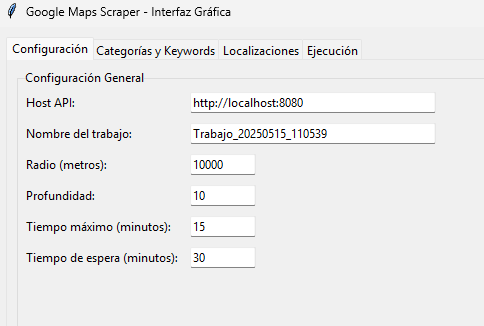
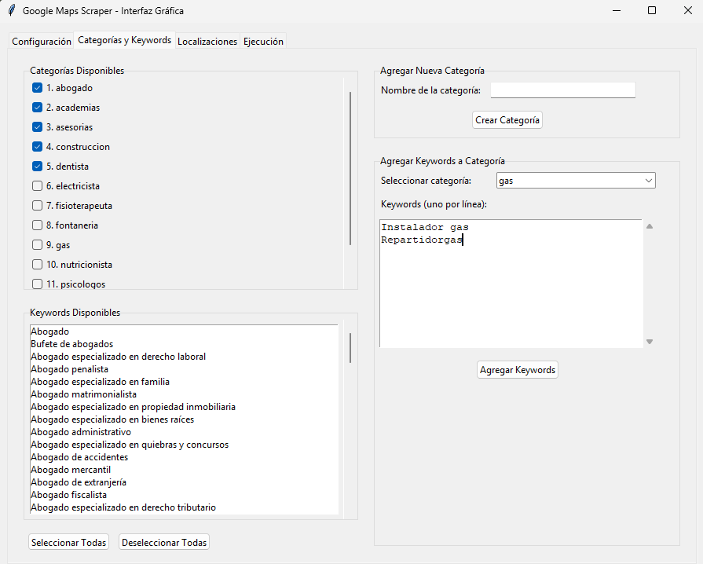
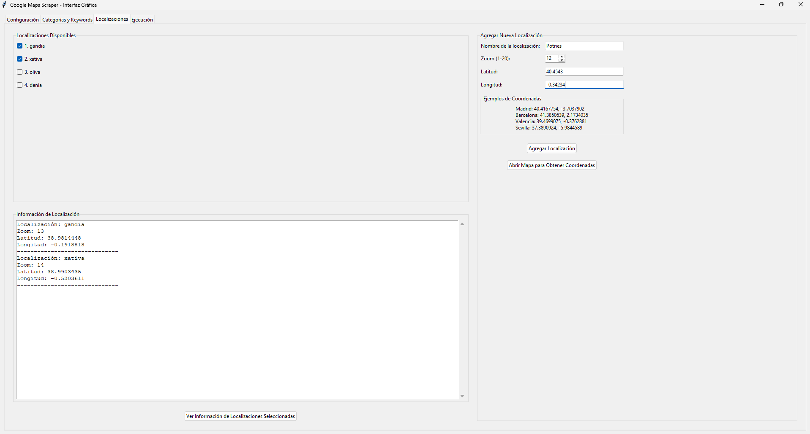
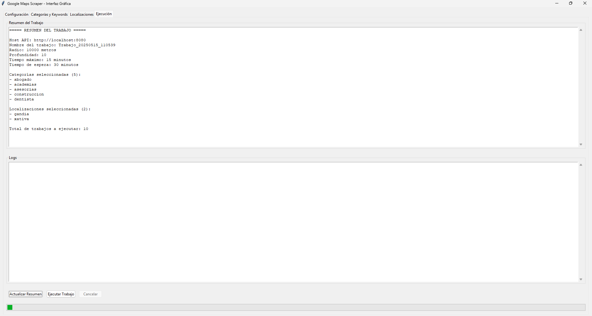

# Google Maps Scraper UI

## Descripción
Google Maps Scraper UI es una interfaz gráfica que facilita el uso del [Google Maps Scraper](https://github.com/gosom/google-maps-scraper) para extraer datos de negocios desde Google Maps. Esta herramienta permite seleccionar categorías de negocios y localizaciones, configurar parámetros de búsqueda y gestionar los trabajos de extracción de datos de forma visual e intuitiva, sin necesidad de usar la línea de comandos.

## Cómo Usar

### Pasos previos

1. **Iniciar Google Maps Scraper API**
   - Ejecuta el archivo `.exe` que se encuentra dentro de la carpeta `API`
   - Se abrirá una ventana de línea de comandos (CMD) y la API se iniciará automáticamente
   - La API estará disponible en `http://localhost:8080` (o el puerto indicado en la CMD)
   - **IMPORTANTE**: No cierres la ventana de CMD durante todo el proceso. Debe permanecer abierta para que la API funcione.

2. **Verificar que la API está funcionando**
   - Abre tu navegador y visita la dirección que aparece en la línea de comandos (ej: `http://localhost:8080`)
   - Deberías ver la interfaz web del Google Maps Scraper
   - **NOTA**: No es necesario modificar ninguna configuración desde esta interfaz web. Toda la configuración se hará desde nuestra aplicación.

### Usando Google Maps Scraper UI

1. **Iniciar la aplicación**
> Se recomienda utlizar pantalla completa

     - Ejecuta `scraper_gui.py`
     - Se abrirá la interfaz gráfica con varias pestañas

2. **Configuración General (Pestaña "Configuración")**
   
   - **Host API**: Mantén el valor predeterminado (`http://localhost:8080`) o ajústalo si la API se ejecuta en otro puerto
   - **Nombre del trabajo**: Introduce un nombre descriptivo para tu trabajo de extracción
   - **Radio (metros)**: Define el radio de búsqueda alrededor de cada ubicación (ej: 10000 para 10km)
   - **Profundidad**: Define cuántos resultados quieres extraer (valores más altos = más resultados)
   - **Tiempo máximo (minutos)**: Límite de tiempo para cada trabajo
   - **Tiempo de espera (minutos)**: Tiempo máximo de espera para que finalice un trabajo

3. **Seleccionar Categorías y Keywords (Pestaña "Categorías y Keywords")**
   
   - Marca las casillas de las categorías de negocios que quieres buscar
   - Puedes usar los botones "Seleccionar Todas" o "Deseleccionar Todas"
   - La lista de keywords asociados a las categorías seleccionadas aparecerá en el área de la derecha
   - **Agregar nueva categoría**: Puedes crear nuevas categorías con el formulario de la derecha
   - **Agregar keywords a categoría**: Puedes añadir keywords a una categoría existente

4. **Seleccionar Localizaciones (Pestaña "Localizaciones")**
   
   - Marca las casillas de las ubicaciones donde quieres buscar
   - Puedes ver la información detallada de las ubicaciones seleccionadas haciendo clic en "Ver Información de Localizaciones Seleccionadas"
   - **Agregar nueva localización**: Puedes añadir nuevas ubicaciones con el formulario de la derecha
   - Si necesitas coordenadas, usa el botón "Abrir Mapa para Obtener Coordenadas"

5. **Resumen y Ejecución (Pestaña "Ejecución")**
   
   - Haz clic en "Actualizar Resumen" para ver un resumen del trabajo que vas a ejecutar
   - Revisa todos los parámetros configurados
   - Cuando estés listo, haz clic en "Ejecutar Trabajo"
   - Confirma la ejecución cuando se te solicite
   - El progreso y los logs se mostrarán en la parte inferior

6. **Monitorear la ejecución**
   - Los mensajes de estado se mostrarán en el área de logs
   - Puedes cancelar la ejecución en cualquier momento con el botón "Cancelar"
   - Al finalizar, se te informará del número total de trabajos completados

7. **Descargar resultados**
   - **IMPORTANTE**: La CMD del Google Maps Scraper debe seguir abierta
   - **Ficheros CSV**: Se guardan en (`API/webdata`), estos csv guardan el contenido de cada uno de los Trabajos. 
   - Ademas en la dirección web mostrada (`http://localhost:8080`) tambien puedes descargarlos directamente , desde allí podrás ver y descargar los resultados en formato CSV directamente.(Solo se puede descargar si estan en verde y pone ok, si pone Working o pending estan en proceso.)
   - **NOTA**: No cierres la CMD hasta haber descargado todos tus resultados

## Instalación

### 1. Instalar Google Maps Scraper API

#### Opción 1: Usar el ejecutable incluido (recomendado)
1. El archivo ejecutable de Google Maps Scraper ya está incluido en la carpeta `API` de este repositorio
2. Simplemente ejecuta el archivo `.exe` dentro de esa carpeta para iniciar la API
3. Se abrirá una ventana de línea de comandos (CMD) y la API se iniciará automáticamente
4. No es necesario realizar ninguna otra configuración

#### Opción 2: Descargar la última versión (si necesitas actualizar)
Si prefieres descargar la versión más reciente o el ejecutable incluido no funciona:

1. Descarga la última versión de Google Maps Scraper desde [GitHub](https://github.com/gosom/google-maps-scraper/releases/tag/v1.8.0)
2. Descomprime el archivo descargado en una carpeta de tu elección
3. Ejecuta el archivo ejecutable incluido:
   - En Windows: Haz doble clic en el archivo `.exe`
   - En macOS/Linux: Usa el comando `./google-maps-scraper`
4. Se abrirá una ventana de línea de comandos y la API se iniciará automáticamente
5. La API estará disponible en `http://localhost:8080` (o el puerto indicado en la CMD)

**IMPORTANTE**: Mantén la ventana de CMD abierta durante todo el proceso.

### 2. Instalar Google Maps Scraper UI

1. Descarga los archivos de este repositorio (o utiliza los que ya tienes)
2. Asegúrate de tener Python 3.6 o superior instalado
3. Instala las dependencias necesarias:
   ```
   pip install tkinter requests
   ```
4. Crea las carpetas necesarias si no existen:
   ```
   mkdir -p keywords location
   ```
5. Ejecuta la aplicación:
   ```
   python scraper_gui.py
   ```

## Estructura de archivos

- `scraper_gui.py`: El archivo principal que contiene la interfaz gráfica
- `keywords/`: Carpeta que contiene archivos de texto con palabras clave por categoría
- `location/`: Carpeta que contiene archivos de texto con información de ubicaciones
- `API/`: Carpeta que contiene el ejecutable de Google Maps Scraper

## Ejemplos de uso comunes

### 1. Buscar restaurantes en Madrid

Si quieres encontrar todos los restaurantes en Madrid:

1. En la pestaña **Configuración**:
   - Establece un radio de 10000 metros
   - Establece una profundidad de 15
   - Nombre del trabajo: "Restaurantes_Madrid"

2. En la pestaña **Categorías y Keywords**:
   - Selecciona "restaurantes" o crea una nueva categoría
   - Asegúrate de incluir keywords como "restaurante", "comida", "cena", etc.

3. En la pestaña **Localizaciones**:
   - Selecciona "Madrid" o crea una nueva localización con las coordenadas de Madrid
   - Si no existe, puedes crear la localización con estos datos:
     - Nombre: Madrid
     - Zoom: 12
     - Latitud: 40.4167754
     - Longitud: -3.7037902

4. En la pestaña **Ejecución**:
   - Actualiza el resumen para verificar la configuración
   - Ejecuta el trabajo
   - Espera a que termine y ve a http://localhost:8080 para descargar los resultados

### 2. Buscar varios servicios en múltiples ubicaciones

Si deseas buscar, por ejemplo, fontaneros, electricistas y carpinteros en varias ciudades:

1. En la pestaña **Categorías y Keywords**:
   - Selecciona las categorías: "fontanería", "electricistas" y "carpintería"
   - O crea estas categorías si no existen

2. En la pestaña **Localizaciones**:
   - Selecciona varias ubicaciones de interés (p.ej., Valencia, Barcelona, Sevilla)

3. En la pestaña **Ejecución**:
   - Verás que se generarán varios trabajos (uno por cada combinación de categoría y localización)
   - Por ejemplo: 3 categorías × 3 ubicaciones = 9 trabajos

Este enfoque te permitirá obtener datos comparativos de diferentes servicios en distintas zonas geográficas con una sola operación.

### 3. Extracción de datos específicos para investigación de mercado

Para análisis de mercado más detallados:

1. Crea categorías muy específicas:
   - Por ejemplo: "restaurantes_vegetarianos", "gimnasios_24h", "tiendas_ecológicas"
   - Añade keywords precisas que apunten exactamente al tipo de negocio

2. Ajusta la profundidad:
   - Usa valores más altos (15-20) para obtener resultados más exhaustivos
   - Ten en cuenta que valores más altos tardarán más tiempo en procesarse

3. Refina el radio:
   - Para áreas urbanas densas, un radio más pequeño (5000m) puede ser suficiente
   - Para áreas rurales o búsquedas regionales, aumenta el radio (20000m o más)

Con estos datos, podrás identificar nichos de mercado, analizar la competencia y descubrir oportunidades de negocio con precisión.

### Consejos para obtener mejores resultados

- **Sé específico con tus keywords**: Cuanto más precisas sean, mejores resultados obtendrás
- **Equilibra la profundidad**: Una profundidad muy alta dará más resultados pero tardará más tiempo
- **Divide áreas grandes**: Para ciudades muy grandes, considera dividirlas en zonas y hacer búsquedas separadas
- **Revisa los resultados parciales**: Puedes ir a localhost:8080 mientras se ejecutan los trabajos para ver los resultados parciales
- **Guarda tus configuraciones**: Anota las configuraciones que dan buenos resultados para reutilizarlas en el futuro

## Créditos y Agradecimientos

Esta interfaz gráfica es un complemento para el excelente [Google Maps Scraper](https://github.com/gosom/google-maps-scraper) desarrollado por [gosom](https://github.com/gosom). El scraper original proporciona una API robusta para extraer datos de Google Maps, mientras que esta interfaz facilita su uso para usuarios no técnicos.

Agradecemos a:
- El autor original de Google Maps Scraper por crear y mantener una herramienta tan útil
- Todos los contribuyentes que han ayudado a mejorar este proyecto
- La comunidad de usuarios que proporciona retroalimentación valiosa

## Notas legales

Este software se proporciona "tal cual", sin garantía de ningún tipo. Utiliza esta herramienta de acuerdo con los términos de servicio de Google y las leyes aplicables en tu jurisdicción. El scraping de datos puede estar sujeto a restricciones legales en algunos casos.

---

**NOTA**: Necesitarás reemplazar `config_tab.png`, `categories_tab.png`, `locations_tab.png`, y `execution_tab.png` con capturas de pantalla reales de tu aplicación para proporcionar una guía visual.
